# Домашнее задание к занятию «Системы контроля версий». Потапчук Сергей.

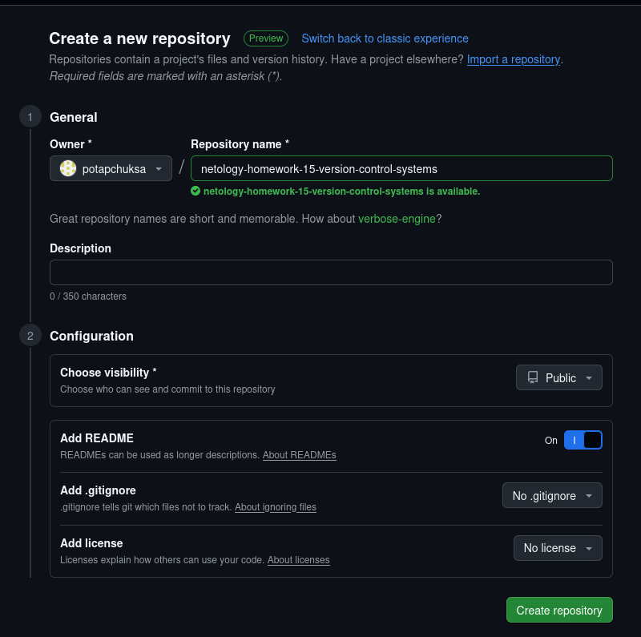

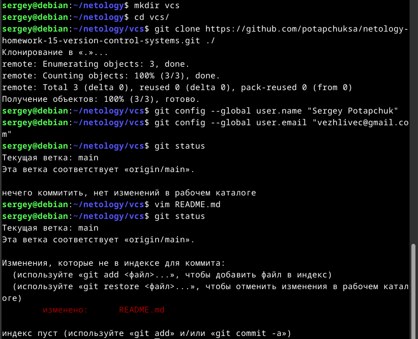

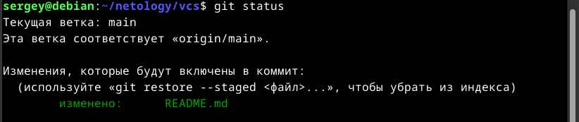

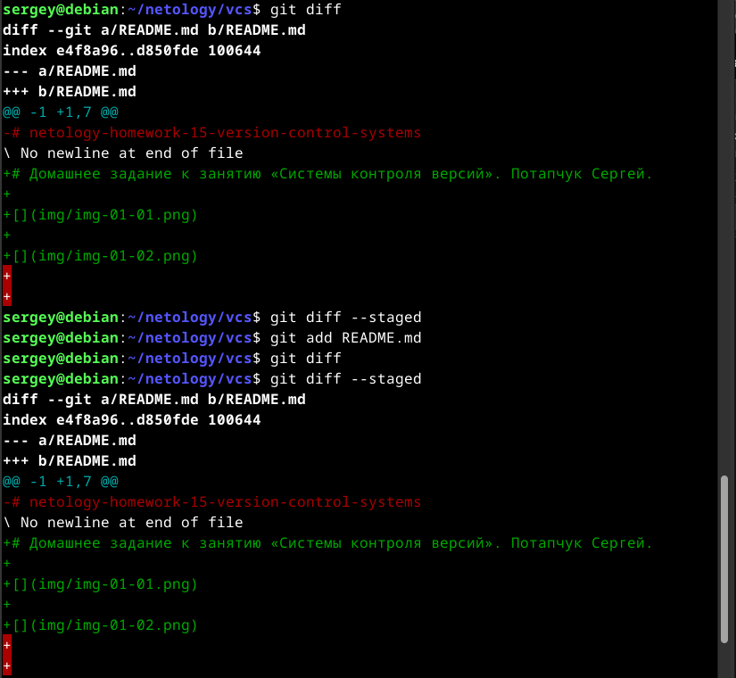

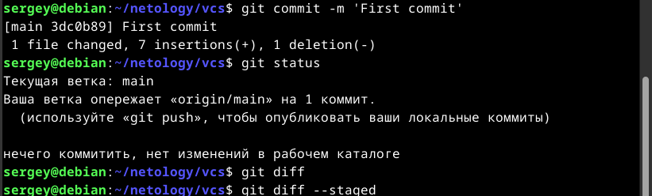

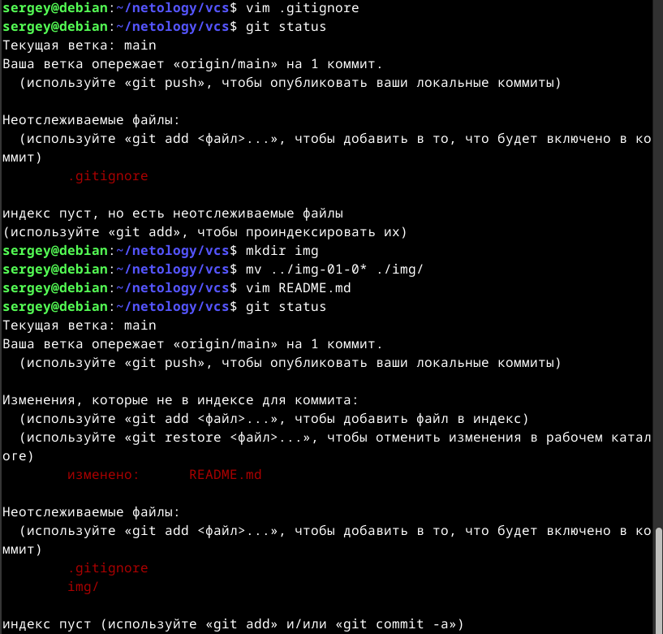

Файл .gitignore описывает игнорирование:

* всех папок .terraform/
* всех файлов заканчивающихся на .tfstate
* всех файлов содержащих .tfstate.
* всех файлов crash.log
* всех файлов начинающихся на crash. и заканчивающихся на .log
* всех файлов заканчивающихся на .tfvars
* всех файлов заканчивающихся на .tfvars.json
* всех файлов override.tf
* всех файлов override.tf.json
* всех файлов заканчивающихся на \_override.tf
* всех файлов заканчивающихся на \_override.tf.json
* всех файлов .terraform.tfstate.lock.info
* всех файлов .terraformrc
* всех файлов terraform.rc

Всех файлов - значит файлов, находящихся в любых каталогах проекта.

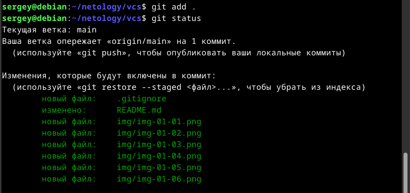

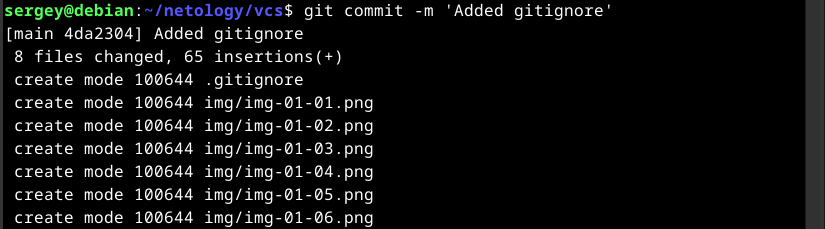

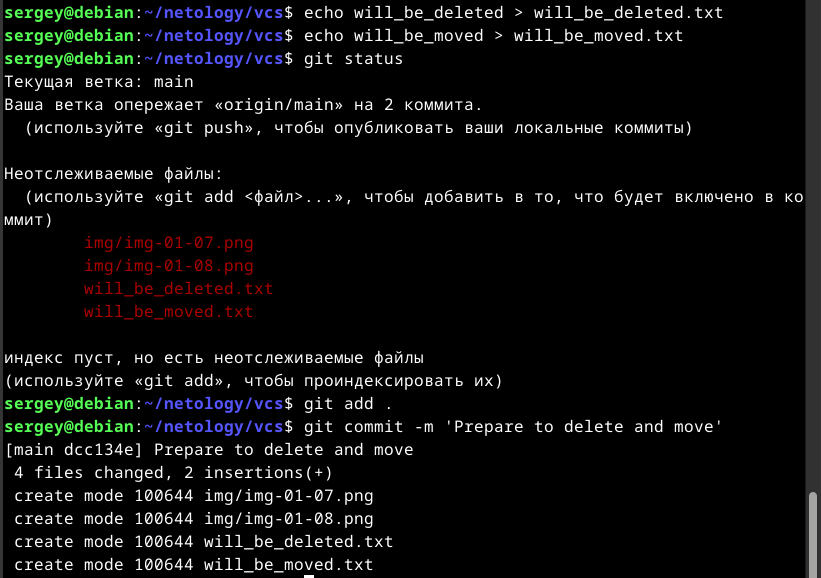

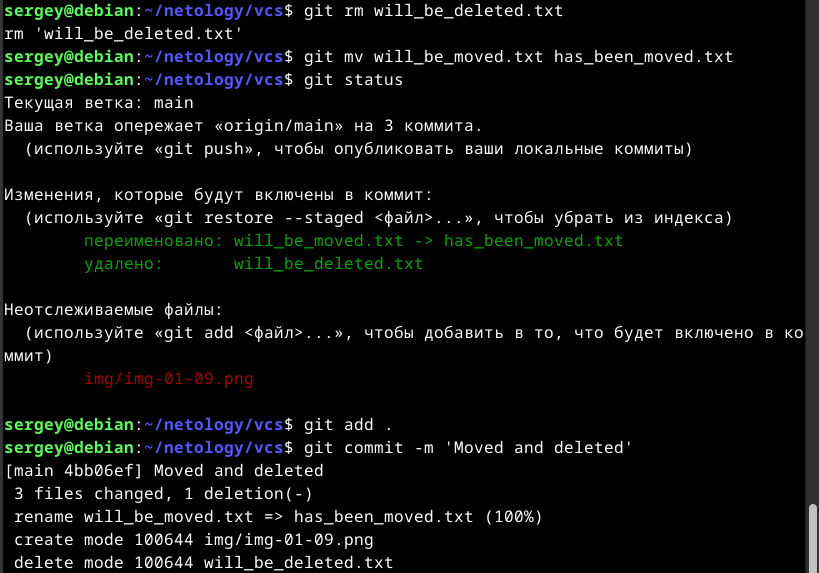

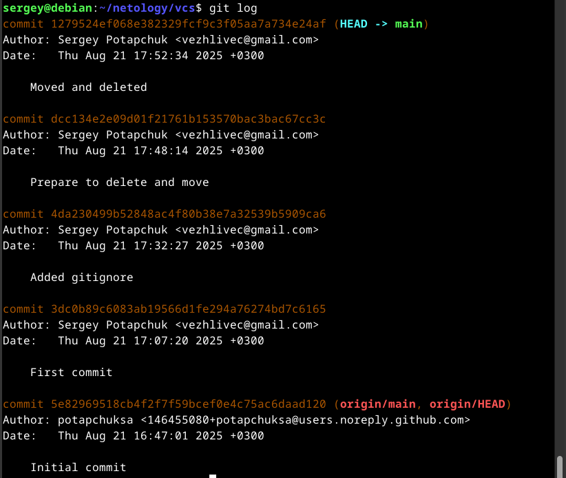
