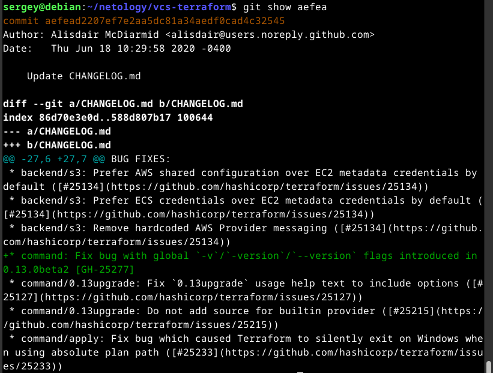
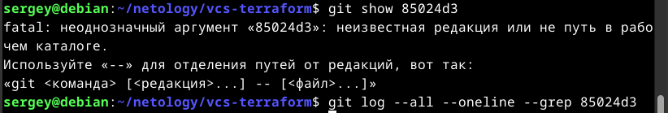
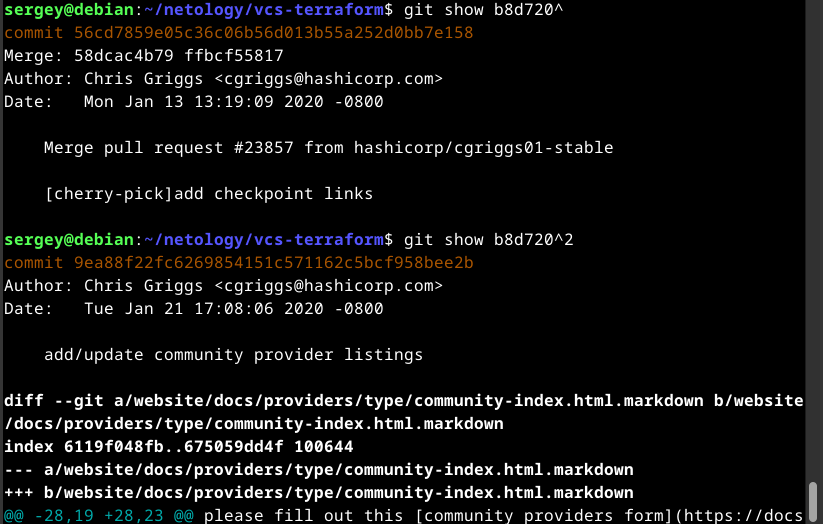
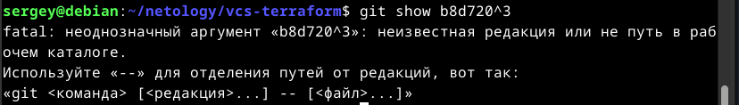

1. Найдите полный хеш и комментарий коммита, хеш которого начинается на aefea.

  * полный хеш:          aefead2207ef7e2aa5dc81a34aedf0cad4c32545
  * комментарий коммита: Update CHANGELOG.md

2. Ответьте на вопросы.

  * Какому тегу соответствует коммит 85024d3?

    - Такого коммита нет (не нашелся даже с помощью log и grep)

  * Сколько родителей у коммита b8d720? Напишите их хеши.

    - 2 родителя с хешами:

      * 56cd7859e05c36c06b56d013b55a252d0bb7e158
      * 9ea88f22fc6269854151c571162c5bcf958bee2b

