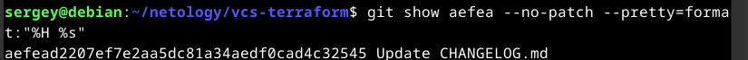
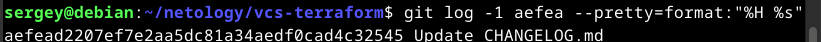
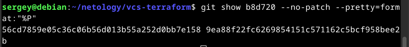

1. Найдите полный хеш и комментарий коммита, хеш которого начинается на aefea.

  * полный хеш:          aefead2207ef7e2aa5dc81a34aedf0cad4c32545
  * комментарий коммита: Update CHANGELOG.md

  * а лучше так

  * или так

2. Ответьте на вопросы.

  * Какому тегу соответствует коммит 85024d3?

    - tag: v0.12.23

  * Сколько родителей у коммита b8d720? Напишите их хеши.

    - 2 родителя с хешами:

      * 56cd7859e05c36c06b56d013b55a252d0bb7e158
      * 9ea88f22fc6269854151c571162c5bcf958bee2b

    - или так

  * Перечислите хеши и комментарии всех коммитов, которые были сделаны между тегами v0.12.23 и v0.12.24.

    - 33ff1c03bb960b332be3af2e333462dde88b279e v0.12.24
    - b14b74c4939dcab573326f4e3ee2a62e23e12f89 [Website] vmc provider links
    - 3f235065b9347a758efadc92295b540ee0a5e26e Update CHANGELOG.md
    - 6ae64e247b332925b872447e9ce869657281c2bf registry: Fix panic when server is unreachable
    - 5c619ca1baf2e21a155fcdb4c264cc9e24a2a353 website: Remove links to the getting started guide's old location
    - 06275647e2b53d97d4f0a19a0fec11f6d69820b5 Update CHANGELOG.md
    - d5f9411f5108260320064349b757f55c09bc4b80 command: Fix bug when using terraform login on Windows
    - 4b6d06cc5dcb78af637bbb19c198faff37a066ed Update CHANGELOG.md
    - dd01a35078f040ca984cdd349f18d0b67e486c35 Update CHANGELOG.md
    - 225466bc3e5f35baa5d07197bbc079345b77525e Cleanup after v0.12.23 release

